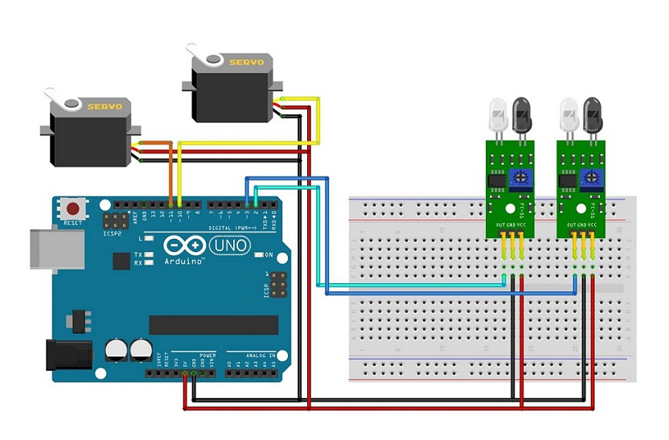

# Automatic Door Control Based on Train Detection with Arduino

This project demonstrates an automatic door control system using an Arduino, IR sensors, and servos. The system automatically opens and closes doors based on the presence of a train detected by IR sensors placed at the entry and exit points.

## Components Used

- Arduino IDE or Text Editor (e.g., Visual Studio Code);
- Library: Servo;
- Arduino Uno (or compatible board) = 1 Unit;
- Servo Motors (2 Units, Type SG90);
- IR Obstacle Sensors (2 Units);
- Project Board / Breadboard (optional);
- Jumper Wires.

## Schematic

- The schematic diagram shows how to connect the IR sensors and servos to the Arduino board. This helps to facilitate wiring from the microcontroller to the devices.

## Circuit Diagram

- **IR Sensor 1 (In):**
  - Connect to digital pin D2 on the Arduino.
- **IR Sensor 2 (Out):**
  - Connect to digital pin D3 on the Arduino.
- **Servo Motor 1:**
  - Connect control pins to digital pin D10 on the Arduino.
  - Power (VCC) to 5V, and GND to GND on the Arduino..
- **Servo Motor 2:**
  - Connect control pins to digital pin D11 on the Arduino.
  - Power (VCC) to 5V, and GND to GND on the Arduino..

## Work Steps

1. Prepare the tools and materials.
2. Assemble the components according to the circuit diagram.
3. Open the Arduino IDE or preferred text editor.
4. Upload the provided code to the Arduino board.

## How It Works

- The system uses two IR sensors to detect the presence of a train: one at the entry point and one at the exit.
- When the entry sensor detects a train (LOW signal), the doors controlled by the servos will open.
- When the exit sensor detects a train (LOW signal), the doors will remain open until the train leaves.
- After detecting that the train has exited, the doors will close automatically after a delay.

## Code Explanation

- The `Servo` library is used to control the servo motors.
- The code reads signals from the IR sensors to determine if the train is at the entry or exit points.
- Based on sensor readings, the servos are activated to open or close the doors.

## Installation

1. Connect the components as described in the circuit diagram.
2. Upload the provided code to your Arduino using the Arduino IDE.
3. Test the system by simulating the presence of a train at the entry and exit sensors.

## Usage

- The servos will automatically control the doors based on the train's presence at the sensors.
- The doors open when the train is detected and close after the train has passed.

## Conclusion

- This automatic door control system enhances operational efficiency by automating door movements based on train detection. It is suitable for applications where trains or similar vehicles require automated gate systems.
- When the train hits sensor 1 or 2 then the servo will close. The servo will reopen when the train regarding other sensors.

#### @Copyright 2024 | Automatic-Door-Control-Based-On-Train-Detection-With-Arduino